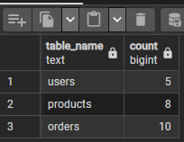
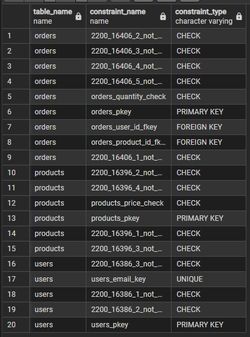
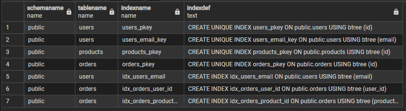

# Анализ структуры базы данных

## Обзор базы данных

База данных содержит три основные таблицы: `users`, `products`, `orders`, которые представляют собой типичную структуру для e-commerce приложения.

## 1. Анализ количества записей

### Выводы:
- **users**: 5 пользователей - небольшая база пользователей
- **products**: 8 товаров - ограниченный каталог
- **orders**: 10 заказов - активность пользователей, среднее количество заказов на пользователя = 2

## 2. Анализ ограничений (Constraints)

### Структура ограничений по таблицам:

#### Таблица `orders` (9 ограничений):
- **CHECK ограничения**: 6 штук
  - `orders_quantity_check` - проверка количества товара
  - 5 автоматически сгенерированных CHECK ограничений
- **PRIMARY KEY**: `orders_pkey` - первичный ключ
- **FOREIGN KEY**: 2 штуки
  - `orders_user_id_fkey` - связь с таблицей users
  - `orders_product_id_fkey` - связь с таблицей products

#### Таблица `products` (6 ограничений):
- **CHECK ограничения**: 5 штук
  - `products_price_check` - проверка цены товара
  - 4 автоматически сгенерированных CHECK ограничений
- **PRIMARY KEY**: `products_pkey` - первичный ключ

#### Таблица `users` (5 ограничений):
- **CHECK ограничения**: 3 штуки (автоматически сгенерированные)
- **UNIQUE**: `users_email_key` - уникальность email
- **PRIMARY KEY**: `users_pkey` - первичный ключ

### Выводы:
- Все таблицы имеют первичные ключи
- Правильно настроены внешние ключи между таблицами
- Email пользователей уникальны
- Есть проверки на корректность данных (цена, количество)

## 3. Анализ индексов

### Структура индексов:

#### Таблица `users`:
- `users_pkey` - уникальный индекс по полю `id` (PRIMARY KEY)
- `users_email_key` - уникальный индекс по полю `email`
- `idx_users_email` - дополнительный индекс по полю `email`

#### Таблица `products`:
- `products_pkey` - уникальный индекс по полю `id` (PRIMARY KEY)

#### Таблица `orders`:
- `orders_pkey` - уникальный индекс по полю `id` (PRIMARY KEY)
- `idx_orders_user_id` - индекс по полю `user_id` (для быстрого поиска заказов пользователя)
- `idx_orders_product_id` - индекс по полю `product_id` (для быстрого поиска заказов товара)

### Выводы:
- Все первичные ключи имеют уникальные индексы
- Email пользователей имеет дублирующий индекс (уникальный + обычный)
- Внешние ключи в таблице orders имеют индексы для оптимизации JOIN операций
- Структура индексов оптимизирована для типичных запросов e-commerce
